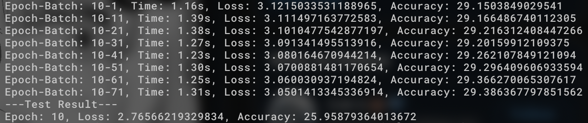
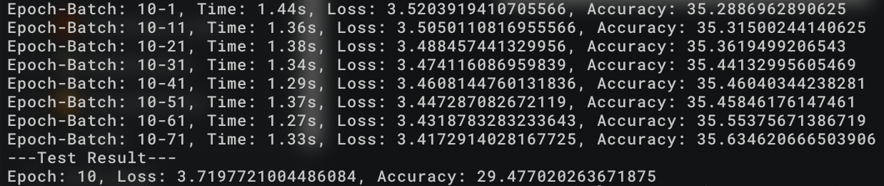
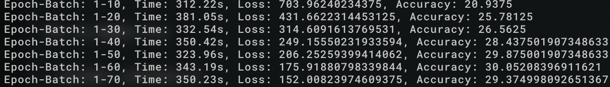
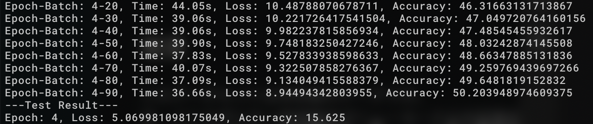
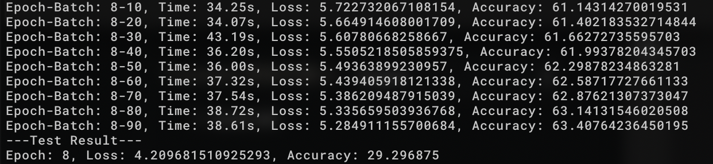

<!--
theme: uncover
size: 16:9
paginate: false
style: |
    section {
        background-color: #333333;
        font-family: "Helvetica Neue",
        Arial,
        "Hiragino Kaku Gothic ProN",
        "Hiragino Sans",
        Meiryo,
        sans-serif;
        font-size: 40px;
        color: #e0e0e0;
        text-align: start;
    }
    h1 {
        text-align: center;
        font-size: 80px;
    }
    h2 {
        display: block;
        position: fixed;
        top: 64px;
        font-size: 56px;
    }
    section.center {
        text-align: center;
    }
    ul {
        margin-left: 0;
    }
    li, ol {
        margin: 24px;
    }
headingDivider: 2
-->
# 第5回データ解析ゼミ

# tensorflow2系を用いたCNNの実装
## はじめに
<!-- _class: center -->
**Mac book proじゃメモリがたりねぇ！！**

# データセットについて
## データセット

メトロポリタン美術館にある日本の浮世絵の作者別にされたデータセット

[The Metropolitan Museum of Art Ukiyoe Dataset](https://www.kaggle.com/kengoichiki/the-metropolitan-museum-of-art-ukiyoe-dataset)

# を使おうとしたけど...
## ダメだった

- データが整形されておらず、サイズがまちまち
- 全部で10GBのデータがぶん投げられる

## それでどうしたか

- 同じデータを用いたコンペティションを発見
- 224 * 224に変換済み

[Ukiyoe author prediction competition held by ProbSpace](https://prob.space/competitions/ukiyoe-author)

# 実装
## 実装(1)
- とりあえず、八谷先生のTensorflow2系でのCNN実装例を参考にSubclassingで実装

## 構成(1)
- Conv3層(32 -> 64 -> 64)
- 全結合層1層(64, relu)
- 出力層(32, softmax)
- Batch Size: 32
- Epochs: 10

## 結果(1)
- accuracy: 25.96%
- loss: 2.77

## 実装(2)
- ぼかしてみることで特徴がわかるんじゃないか

## 構成(2)
- 構成(1)と同じ
- ガウシアンフィルタをかける

## 結果(2)
- accuracy: 29.48%
- loss: 3.72

## 実装(3...k)
- mnistは28 * 28だったけど、今回のは224 * 224だから、Conv層の出力の数を増やすべきでは
- ついでにEpochs毎にランダムなBrightness入れよう

## 構成(3...k)
- Conv3~6層(色々)
- 他は構成(2)と同じ
- Epochs毎にランダムなBrightness

## 結果(3...k)
- test実行時にメモリが吹っ飛ぶ
- Epoch1までしか学習できず
- ただ、Accuracyの調子はEpoch1にしては良さそう

## 考察(3...k)
- 計算量が大きくなりすぎ
- メモリを監視していると
    - 学習時でも90%近く
    - testが走ると100%を越えメモリエラーを吐く
    - テストケースを総データ数の2割確保
        - ミニバッチで実行してなかった

## 実装(k...)
- テストケースをBatch Sizeと同量に
- ついでに全結合層増やそう
- Conv層は前より控えめにしよう

## 構成(k...)
- Conv3層(64 -> 128 -> 256)
- 全結合層3層(256 -> 512 -> 256)
- 他は構成(3...k)と同じ

## 結果(k...)
- train_accuracyに対してtest_accuracyが悪い
    - そんなに学習してない気がするけど過学習か？
        - 学習自体がさてはうまくいってない？
        - テストケースが少ない？
- lossの値おかしい気がする？

## 結果2(k...)
Epoch 4時点

## 結果3(k...)
Epoch 8時点

## 考察(k...)
- メモリの問題は軽くなった
- 学習がうまくいってない or テストケースが少なすぎる
    - テストケースをBatch Sizeで分割して、LossとAccuracyはそれらの平均とすれば良いのか

## 結果が出るまで
<!-- _class: center -->
**プロテイン入りのカレーを作っていました**